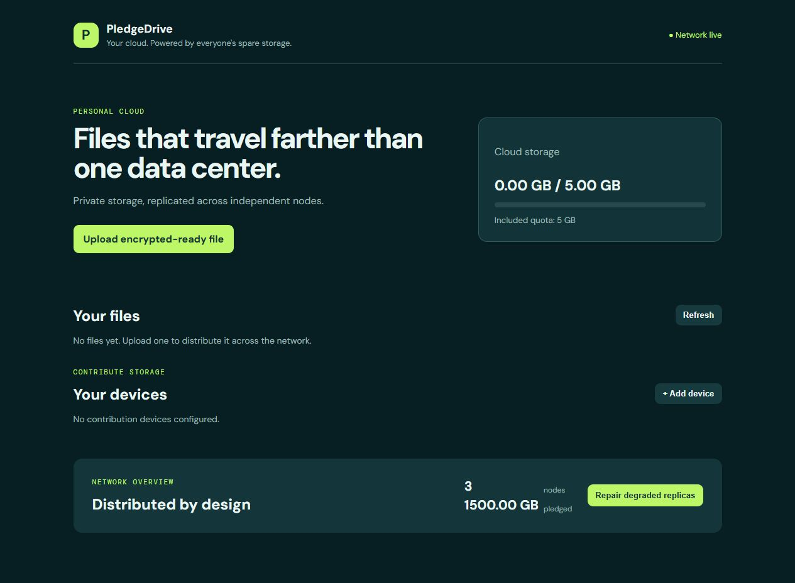

# PledgeDrive

**Your cloud. Powered by everyone's spare storage.**



This repository is an executable MVP of the PledgeDrive control plane and web client. It is deliberately candid about scope: the working local path has a web UI, API, quota accounting, file/chunk metadata, deterministic replica placement, integrity checks, failure repair, node state transitions, and append-only credit entries. Native file-system sync, persistent PostgreSQL/Redis repositories, signed node authentication, and browser end-to-end key handling are the next build phases—not simulated features.

## Architecture

```
Web client / native clients / node agents
              │ HTTPS / outbound control channel
              ▼
API ─── metadata + quotas + ledger ─── PostgreSQL (production adapter)
              │
              ▼
Storage orchestrator ─── placement / repair / integrity ─── node protocol
```

The central [`packages/config/src/index.ts`](packages/config/src/index.ts) owns product identity, default 5-GB quota, replication factor, chunk size, economics, and policies. The local demo starts three independent provider nodes; uploaded data is chunked (4 MiB), hashed, placed on three unique providers, and repaired to another node after a failure.

## Run locally

```bash
npm install
npm run dev
# open http://localhost:8787
```

Use `npm run demo` to run the three-node integration scenario. Quality gates:

```bash
npm test
npm run lint
npm run typecheck
npm run build
```

For supporting infrastructure, copy `.env.example` to `.env`, set real secrets, then run:

```bash
docker compose -f infrastructure/docker-compose.yml up -d
```

The PostgreSQL schema is in [`packages/database/migrations/001_initial.sql`](packages/database/migrations/001_initial.sql). Wiring that schema into a repository layer is required before deploying beyond local demo usage.

## API and node agent

`GET /api/dashboard` returns account and network state. `POST /api/upload?name=...` accepts bytes and writes three replicas. `GET /api/files/:id` reads a healthy verified replica. `PATCH /api/nodes/:id/status` transitions a node, and `POST /api/repair` restores replication.

The CLI interface is available now:

```bash
npm run node -- node init
npm run node -- node status
npm run node -- node pause
```

It defines the Linux/NAS-friendly commands; a real daemon service, Docker node image, Windows Service, macOS LaunchAgent and native Android/iOS projects remain planned.

## Encryption and privacy

[`packages/crypto/src/index.ts`](packages/crypto/src/index.ts) uses standard AES-256-GCM and SHA-256 helpers, with a fresh 96-bit nonce per chunk. The intended model is client-held master key → file key → encrypted chunks; node storage sees only encrypted chunk bytes and integrity hashes. **The local demo upload endpoint has not yet connected browser-side key generation/envelope wrapping, so it must only be used with non-sensitive test data.** No production privacy claim should be made until that client integration, key recovery/sharing design, transport auth, and security review are complete.

## Platform status

| Platform | Files | Sync | Contribution |
|---|---|---|---|
| Web | Working local MVP | Browser upload/download | N/A |
| Windows/macOS/Linux/NAS | API/CLI contract | Planned native agent | Planned full node |
| Android/iOS | Planned | Planned | Planned intermittent, OS-limited node |

Mobile contribution will never be a critical-only replica and must honor Wi-Fi, charging, battery, and background limits.

## Before public launch

Implement persistent Postgres/Redis and object/node storage adapters; authenticated outbound node protocol with capacity proof; resumable encrypted client uploads/downloads; real workers and durable repair jobs; rate limiting/auditing/observability; retention/sharing/versioning; native sync and installers; threat modelling, penetration testing, legal/abuse controls, and disaster recovery exercises.
